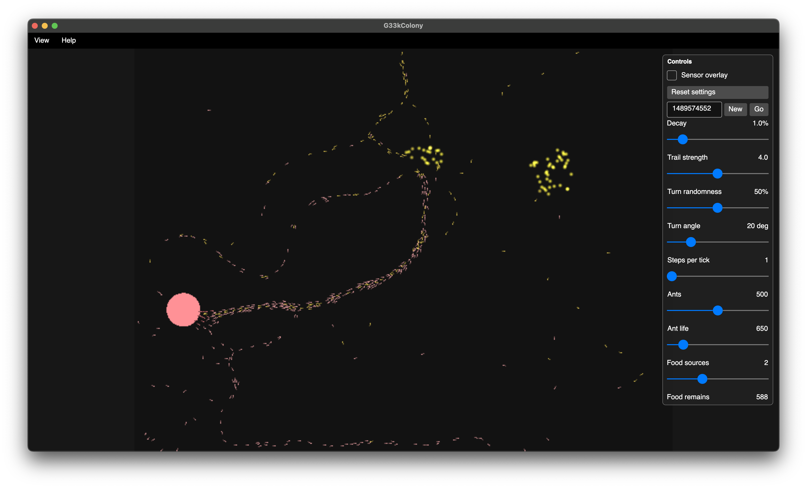
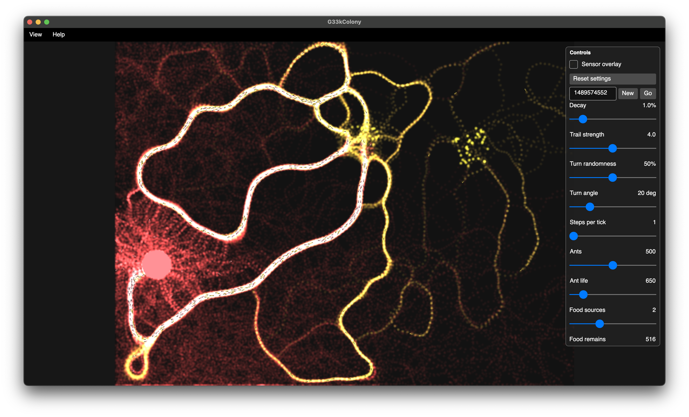

[](https://twitter.com/deanthecoder)
[](https://github.com/deanthecoder/G33kColony/stargazers)

# G33kColony
A small ant simulation where simple local rules create complex behaviour.

A cross-platform Avalonia ant colony simulation.



## Video
Watch the simulation in action on YouTube: [https://youtu.be/wGD0uD28COw?si=cbYM1CIKxNFs32AP](https://youtu.be/wGD0uD28COw?si=cbYM1CIKxNFs32AP)

## Purpose
G33kColony is a small desktop app for watching simple ants create surprisingly organised trails between a nest and nearby food.

The interesting part is how complex-looking behaviour emerges from very simple local rules.

## What you can do
- Watch ants search for food, collect it, and return to the nest.
- Tune the simulation while it runs.
- Change the seed to get a new world layout.
- Draw and erase obstacles directly in the simulation area while the ants are moving.
- Toggle pheromone overlays to see the hidden trails ants are following.
- Toggle the sensor overlay to see the three look-ahead areas each ant samples.
- Reset settings back to the built-in defaults.

## Pheromone view


## How it works
Each ant has a position, a direction, and a simple state: searching for food, or returning home with food.

Searching ants leave a home trail as they wander away from the nest. If they see food directly, they head for it. Otherwise, if they smell a food trail, they steer toward it using a weighted blend of nearby signals rather than a single fixed direction.

Returning ants do the opposite. They carry food, leave a food trail behind them, and follow home scent back toward the nest. If they can see the nest directly, they head straight for it.

Pheromones evaporate over time and are refreshed by passing ants, creating a fading trail that highlights useful paths while allowing old or unhelpful routes to disappear.

Ants also gently avoid one another using a simple separation rule, so busy trails look more like traffic than a stack of overlapping dots.

Ants spawn and return at the edge of the nest, which helps avoid congestion and keeps traffic flowing.

## Controls
The main controls let you adjust:

- Ant count
- Ant lifetime
- Simulation speed
- Food source count
- Pheromone decay
- Pheromone strength
- Random turn chance and angle
- Home and food pheromone visibility
- Sensor overlay visibility

In the simulation view:
- Left-drag draws obstacles.
- Right-drag erases obstacles.
- Option/Alt + left-drag also erases (useful on some trackpads).

Your UI settings are saved when the app exits and restored next time.

## Build and run
Prereqs: .NET 8 SDK.

```bash
dotnet build G33kColony.sln
dotnet run --project G33kColony.csproj
```

## Test
```bash
dotnet test G33kColony.sln
```

## License
Licensed under the MIT License. See [LICENSE](LICENSE) for details.
